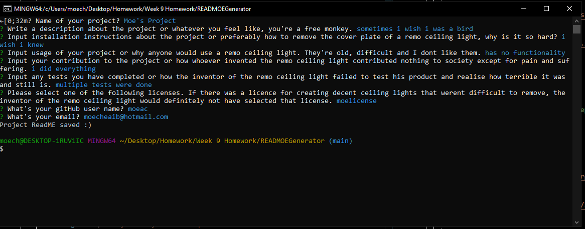
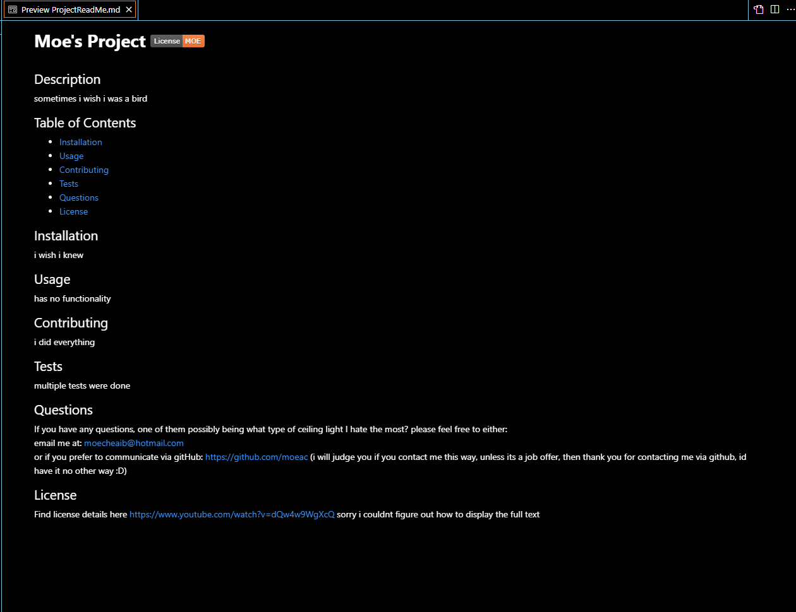

# READMOEGenerator

# Links

GitHub Repo: https://github.com/moeac/READMOEGenerator  
Video: https://watch.screencastify.com/v/IB9Urm2Wgbx9WqNToiuM

# Description
Read me generator runs on node after running index.js in command terminal. 
Asks user for certain information regarding their project and generates a read me with basic layout of: 
- Title
- Description
- Table of Contents
- Installation
- Usage
- Contributing
- Tests
- Questions
- License

Also asks the user for which license theyd like to use and prints a badge as well as provides a link. Tried to append it to the readme but couldnt figure it out using fs.read and fs.append. 
Also takes users email and github username and links to their github repo. 
Read me is then saved to a file called 'ProjectReadMe.md'

# Screenshots

Running command

Generated ReadMe
